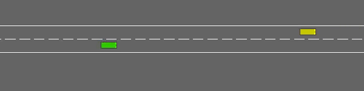
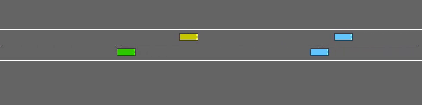
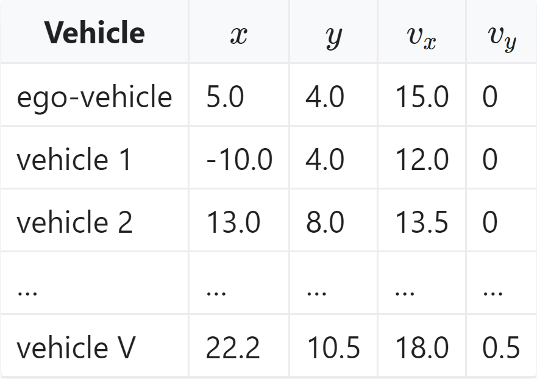

# Highway-env based adversarial testing
## 1. Visualization
<table>
    <tr>
        <td ><center>Cut in scenario </center></td>
        <td ><center>Slow down scenario</center></td>
    </tr>
</table>

## 2. Usage
### 1. Install highway-adv-env
```
python setup.py install
```
### 2. Install the stable-baselines3 (for training the DQN model as Ego) 
Stable-Baselines3 requires python 3.8+ and PyTorch >= 1.13
* windows:
```
pip install stable-baselines3[extra]
```
- Ubuntu:
```
pip install "stable-baselines3[extra]"
```
### 3. Train the ego agent
```
python EgoAgent_trainer_DQN.py
```
### 4. Train the BV model with different Ego agent
- DQN-Ego
```
python Adv_main.py --Ego_model_name="DQN-Ego" --train
```
- IDM-EGO
```
python Adv_main.py --Ego_model_name="IDM-Ego" --train
```
### 5. Test the BV model and rendering
- DQN-Ego
```
python Adv_main.py --Ego_model_name="DQN-Ego" --test --render
```
- IDM-EGO
```
python Adv_main.py --Ego_model_name="IDM-Ego"  --test --render
```
### 6. Open the tensorboard
- DQN as ego car
```
tensorboard --logdir=./AdvLogs/DQN-Ego
```
- IDM as ego car
```
tensorboard --logdir=./AdvLogs/IDM-Ego
```
## 3. Environment: highway_env_adv
### 1. Initial condition of all the vehicles：
- **`Creating type of all the vehicle`**  
[highway_env_adv](highway_env/envs/highway_env_adv.py) The first controlled car is the ego car (MDPVehicle or IDMVehicle), while the second is the selected car (AdvVehicle)
- **`The initial position of all the vehicle`**  
Initial place of all the vehicle is decided by their specific **speed**, **land_id**, **spacing**, etc

### 2. The AdvVehicle type：
[AdvVehicle](highway_env/vehicle/behavior.py) 
- **`Action`**  
The selected bv is the AdvVehicle type, which using a RL model to perform a high-level action.  
```
ACTIONS_ALL = {
        0: 'LANE_LEFT',
        1: 'IDLE',
        2: 'LANE_RIGHT',
        3: 'FASTER',
        4: 'SLOWER'
    }
```
- **`Observation`**  
The input of the RL model is the corresponding observation of the selected bv
<p align="center">
    <br/>
    <em>The example observation of ego car.</em>
</p>