# Highway-env based adversarial testing
## 1. Visualization

### DQN Ego

#### 2 lanes

| 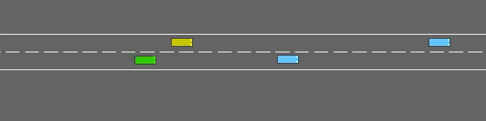 | 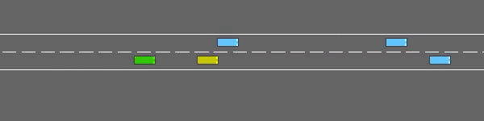 |
| :----------------------------------------: | :------------------------------------------: |
|                   Cut in                   |             Rear-end collistion              |


#### 3 lanes

| 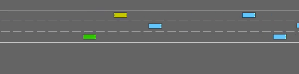 | 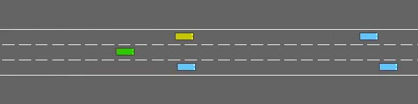 |
| :------------------------------------------: | :------------------------------------------: |
|                    Cut in                    |                    Cut in                    |


### IDM Ego

#### 2 lanes

| 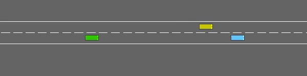 |  |
| :------------------------------------------: | :-----------------------------------------: |
|                   Crashed                    |                   Cut in                    |


#### 3 lanes

| 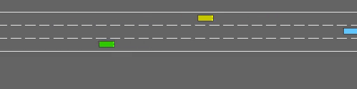 | 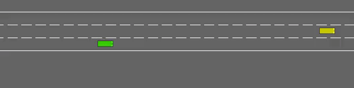 |
| :-----------------------------------------: | :------------------------------------------------: |
|                   Cut in                    |                      Crashed                       |


## Training losses and reward

### DQN Ego

| 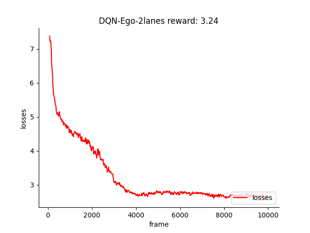 | 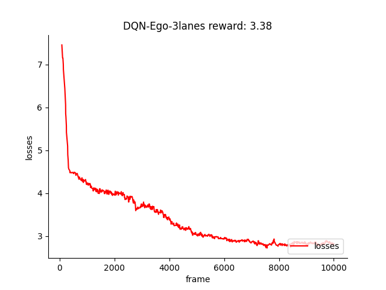 |
| :-----------------------------------------------: | :-----------------------------------------------: |
|                      2 lanes                      |                      3 lanes                      |


### IDM Ego

| 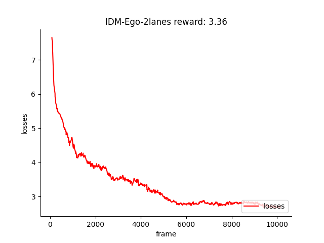 | 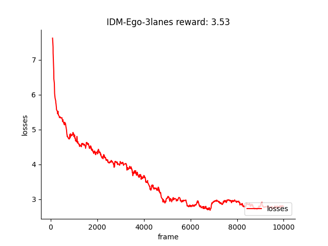 |
| :----------------------------------------------------------: | :-----------------------------------------------: |
|                           2 lanes                            |                      3 lanes                      |


## 2. Usage

### 1. Install highway-adv-env
```
git clone git@github.com:CurryChen77/Highway-env-adversarial.git
cd Highway-env-adversarial
python setup.py install
```
### 2. Install the stable-baselines3 (for the pretrained DQN Ego model) 
Stable-Baselines3 requires python 3.8+ and PyTorch >= 1.13
* windows:
```
pip install stable-baselines3[extra]
```
- Ubuntu:
```
pip install "stable-baselines3[extra]"
```
### 3. (Optional) Train your own DQN ego agent
```
python EgoAgent_trainer_DQN.py
```
### 4. Train the BV model with different Ego agent
- DQN-Ego
```
python Adv_main.py --Ego="DQN-Ego" --train
python Adv_main.py --Ego="DQN-Ego" --train --lane_count=3
```
- IDM-EGO
```
python Adv_main.py --Ego="IDM-Ego" --train
python Adv_main.py --Ego="IDM-Ego" --train --lane_count=3
```
**default: 2 lanes**

Can be changed by  **--lane_count**


### 5. Test the BV model and rendering

- DQN-Ego
```
python Adv_main.py --Ego="DQN-Ego" --test --render
python Adv_main.py --Ego="DQN-Ego" --test --render --lane_count=3
```
- IDM-EGO
```
python Adv_main.py --Ego="IDM-Ego"  --test --render
python Adv_main.py --Ego="IDM-Ego"  --test --render --lane_count=3
```
**default: 2 lanes**

Can be changed by  **--lane_count**

### 6. Open the tensorboard

- DQN as ego car
```
tensorboard --logdir=./AdvLogs/DQN-Ego-2lanes
tensorboard --logdir=./AdvLogs/DQN-Ego-3lanes
```
- IDM as ego car
```
tensorboard --logdir=./AdvLogs/IDM-Ego-2lanes
tensorboard --logdir=./AdvLogs/IDM-Ego-3lanes
```
## 3. Environment: highway_env_adv
### 1. Initial condition of all the vehicles：
- **`Creating type of all the vehicle`**  
[highway_env_adv](highway_env/envs/highway_env_adv.py) The first controlled car is the ego car (MDPVehicle or IDMVehicle), while the second is the selected car (AdvVehicle)
- **`The initial position of all the vehicle`**  
Initial place of all the vehicle is decided by their specific **speed**, **land_id**, **spacing**, etc

### 2. The AdvVehicle type：
[AdvVehicle](highway_env/vehicle/behavior.py) 
- **`Action`**  
The selected bv is the AdvVehicle type, which using a RL model to perform a high-level action.  
```
Bv_Action = {
        0: 'LANE_LEFT',
        1: 'IDLE',
        2: 'LANE_RIGHT',
        3: 'FASTER',
        4: 'SLOWER'
    }
```
- **`Observation`**  
The input of the RL model is the corresponding observation of the selected bv
<p align="center">
    <br/>
    <em>The example observation of ego car.</em>
</p>