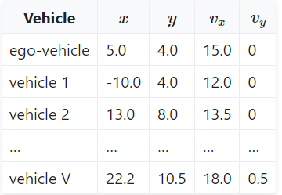

# Highway-env based adversarial testing

## Usage
1. Install highway-adv-env
```
python setup.py install
```
2. Install the stable-baselines3  
Stable-Baselines3 requires python 3.8+ and PyTorch >= 1.13
```
pip install stable-baselines3[extra]
```
3. Train the ego agent
```
python .\EgoAgent_trainer_DQN.py
```

## Environment: highway_env_adv
### 初始条件：
1. 创建自车以及周车的初始位置[highway_env_adv](highway_env/envs/highway_env_adv.py)中的_create_vehicles()函数  
* **创建逻辑：**
* 将所有车辆（自车、周车）全部归入self.controlled_vehicles中
* 创建时，第一辆controlled为自车，其余为周车，且自车的类型为self.action_type.vehicle_class(即为MDPVehicle类)
* 创建时，除第一辆controlled的为周车，周车类型为other_vehicle_type(即为AdvVehicle类)但由于AdvVehicle没有create_random函数，因此使用的是Vehicle类的create_random函数，和自车一致
2. 初始条件可改的为create_random中的speed, land_id, spacing等

### 周车行驶行为类：
[AdvVehicle](highway_env/vehicle/behavior.py)
通过改变act函数来确定接收到来自bv_model发出的action动作后，某一周车采取怎样的行为
1. 基于IDM模型的act()，在IDM模型计算得到的acceleration, steering后加上bv_model输出的adv_acc, adv_steering，由Vehicle类（运动学模型）执行
2. high-level的动作，传入字符串动作("FASTER", "LANE_LEFT"等)

### Main脚本
[Adv_main](Adv_main.py)
1. env_config中，obs类型为MultiAgentObservation，从而实现获得的obs为所有车辆独特的obs，其中ego由于在controlled_vehicle中是第一辆，因此
传出的obs中，第一个为ego的obs，其余的为周车的obs
```
"observation": {
   "type": "MultiAgentObservation",  # get the observation from all the controlled vehicle (ego and bv)
   "observation_config": {
       "type": "Kinematics",
   }
},
```
2. bv_model输入一辆周车的obs，输出一辆周车的action
3. 当前设定的bv_action是list类型，即每一个list中的元素为一辆周车的action

## TODO
### 确定自车模型 (pretrained)  
1. 训练ego时，需要确定obs的维度，即所有车辆的数目，不同的车辆数目会影响模型的输入，目前指定为两辆周车，一辆自车

2. 当周车数目增加时，是否需要考虑离自车最近的N辆车作为模型输入的车辆数目保持维度一致，但这需要改变Obs的计算方式，需修改环境中的observation.py文件，不然不能直接用gym的接口
3. 训练自车时，周车策略采用的是IDM

### 确定周车模型 (BV model need training)

#### 周车模型使用方法

1. **针对环境中每一辆车，送入周车模型计算对应单车的action**

   解决方法：采用MultiAgentObservation，每一辆周车都具有其各自的Obs, 其各自的Obs中，第一行为自己的state，往下顺序按照其他车辆和自己的距离远近  
   依次递增  
   且将所有环境车辆都加入到self.controlled_vehicle中，但ego为其中的第一个，且其类别为MDPVehicle，其他周车的类别为AdvVehicle

   

2. 针对环境中所有的车辆，送入周车模型计算所有车辆的action

   obs可保持一致，但输出的action为二维矩阵，行表示每一辆车的action

3. 只针对周车中最近的一车

   obs需要将最近车的state放在第一行，obs需要实时根据最近车辆的改变而改变，输出的action仅一维

#### 周车模型具体动作

1. 以IDM模型为基础，action为连续的acc和steering值，与IDM模型计算结果相加

   出现震荡，转弯和直行时，容易左右震荡，且每做一次决定更新之后，下一个时刻IDM计算时，会将扰动考虑进去？

2. 连续的action值（acc，steering）

   学习困难，因为从控制方面计算，收敛难？

3. **high-level的action决定 (faster, slower, change left, change right, IDLE)**

   周车的网络根据其自己各自的输入Obs，输出high-level action的编号，并重写了_simulate function

#### 周车模型模型训练

1. obs：各个周车各自的obs
2. action：high level action的index
3. reward：自车 -reward

### 确定AdvEnv环境中，车辆的初始条件设置

#### 针对已有创建车辆时的参数

车辆初始条件设置参数：

1. speed，每辆车的初始速度，学习
2. spacing，放置每辆车时，与前车的间隔，学习
3. offset比例，根据前车计算后车时，会在spacing上添加一个随机的偏移量，学习
4. 初始车道，给定
5. 目标车道，随机？

#### 完全自定义

二维矩阵

1. 车辆所处的车道
2. 车辆纵向坐标
3. 车辆初始速度