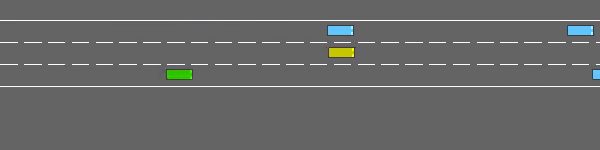
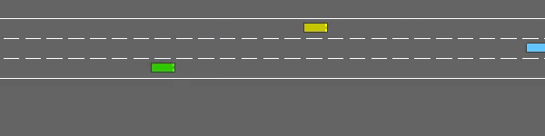

# Highway-env based adversarial testing
## 1. Visualization

### DQN Ego

#### 2 lanes scenario

|  |  |
| :----------------------------------------: | :------------------------------------------: |
|             Frontal collision              |              Lateral collision               |


#### 3 lanes scenario

|  |  |
| :-----------------------------------------: | :------------------------------------------: |
|            Emergency lane change            |            Emergency lane change             |


### IDM Ego

#### 2 lanes scenario

|  |  |
| :------------------------------------------: | :-----------------------------------------: |
|        Surrounding vehicle collision         |            Emergency lane change            |


#### 3 lanes scenario

|  |  |
| :------------------------------------------: | :------------------------------------------------: |
|            Emergency lane change             |           Surrounding vehicle collision            |


## Training reward


## 2. Usage

### 1. Install highway-adv-env
```
git clone git@github.com:CurryChen77/Highway-env-adversarial.git
```
```
cd Highway-env-adversarial
```

```
pip install .
```

### 2. Install the stable-baselines3 (for the pretrained DQN Ego model) 

[Stable-Baselines3](https://github.com/DLR-RM/stable-baselines3) requires python 3.8+ and PyTorch >= 1.13

* windows:
```
pip install stable-baselines3[extra]
```
- Ubuntu:
```
pip install "stable-baselines3[extra]"
```
### 3. (Optional) Train your own ego agent
--ego_type (DQN, A2C, PPO)
```
python Ego_Agent/Trainer.py --train --ego_type DQN
```
### 4. Train the CBV model with different Ego agents
--Ego (DQN-ego A2C-ego, PPO-ego)
```
python Adv_main.py --Ego="DQN-Ego" --train  # defaule 2 lanes
python Adv_main.py --Ego="DQN-Ego" --train --lane_count=3  # 3 lanes
```
**default: 2 lanes**
Can be changed by **--lane_count**
### 5. Test the BV model and render
--Ego (DQN-Ego A2C-Ego, PPO-Ego)
```
python Adv_main.py --Ego="DQN-Ego" --test --render  # defaule 2 lanes
python Adv_main.py --Ego="DQN-Ego" --test --render --lane_count=3  # 3 lanes
```
**default: 2 lanes**

Can be changed by **--lane_count**

### 6. Open the tensorboard
```
tensorboard --logdir=AdvLogs
```

### 7. Plot training reward
```
python plot.py
```

## 3. Environment: highway_env_adv
### 1. Initial condition of all the vehicles：
- **`Creating type of all the vehicle`**  
[highway_env_adv](highway_env/envs/highway_env_adv.py) The first controlled car is the **ego car** (MDPVehicle or IDMVehicle, rendered as **green vehicle** in the image), while the second is the **selected bv** (AdvVehicle, rendered as **yellow vehicle** in the image)
- **`The initial position of all the vehicle`**  
Initial place of all the vehicle is decided by their specific **speed**, **land_id**, **spacing**, etc

### 2. The AdvVehicle type：
[AdvVehicle](highway_env/vehicle/behavior.py) 

* **`Selection`**

  The **selected bv** is the closest vehicle in front of the ego vehicle in each frame (rendered as **yellow vehicle** in the image, while the rest **blue vehicles** are the normal background vehicle controlled by IDM model)

- **`Action`**  
The **selected bv** is the type of AdvVehicle, which using a RL model to perform a high-level action.  
```
Bv_Action = {
        0: 'LANE_LEFT',
        1: 'IDLE',
        2: 'LANE_RIGHT',
        3: 'FASTER',
        4: 'SLOWER'
    }
```
- **`Observation`**  
The input of the RL model is the corresponding observation of the **selected bv**, where the first row of observation is the selected bv's state. 
<p align="center">
    <br/>
    <em>The example observation of ego car.</em>
</p>